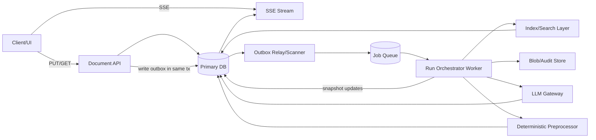
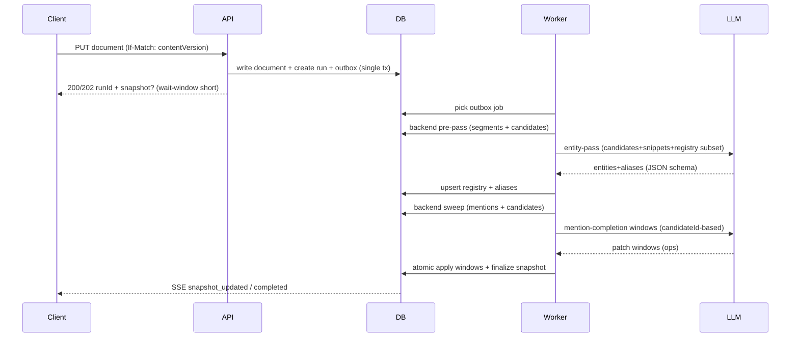

# Идеальная hybrid-архитектура LLM+backend для extraction сущностей в больших RU-текстах

## Executive summary

Оптимальная архитектура для RU-first extraction в больших текстах — это **semantic-first canonicalization (LLM)** + **deterministic grounding (backend)**, где LLM решает смысловые задачи (кто есть кто, что считать сущностью, как объединять варианты имен), а backend гарантирует **оффсеты, стабильность, индексацию, воспроизводимость и масштабирование**. Ключевая сдвижка относительно “backend-first + LLM patch”: **первым делом строим канон сущностей (entities+aliases) с помощью LLM, но кормим модель не сырым 100k-символьным текстом целиком, а сжатым представлением (кандидатные именные фразы + контексты)**; затем backend “прибивает” канон к тексту через детерминированный sweep; затем LLM точечно добирает сложные упоминания (coref/неявные/конфликтные), работая строго по **candidateId**, без права создавать произвольные span/offset.

Надежность и масштабируемость достигаются за счет: **strict version gate** (runId+contentVersion), **atomic apply per window** в транзакции, **structured outputs (JSON Schema strict)** для LLM-ответов и **outbox-паттерна** для очередей/фаз без “двойной записи” (DB + брокер). Structured outputs позволяют требовать строгого JSON по схеме. citeturn5search4turn6search3turn6search10 Outbox решает надежную постановку фоновых задач при сохранении документа. citeturn7view2turn3search8

---

## Архитектура компонентов

### Компоненты и ответственность

| Компонент | Ответственность | Технологии/опции по умолчанию |
|---|---|---|
| Document API | PUT/GET документа, optimistic concurrency, выдача snapshot | HTTP + ETag/If-Match semantics citeturn2search17turn7view0 |
| Run Orchestrator (worker) | state machine run/phases, планирование LLM задач, retry/backoff | фоновые воркеры + outbox citeturn7view2turn3search14 |
| Deterministic Preprocessor | сегментация, токены, нормализация, кандидаты имен (cheap) | entity["organization","razdel","ru tokenizer"] для сегментации (оптимизирован под news+fiction) citeturn6search2turn1search0; entity["organization","pymorphy2","ru morph analyzer"] для нормальных форм/морфологии citeturn1search1turn1search20; entity["organization","Yargy","ru rule extraction"] для паттернов/грамматик (зависит от pymorphy2) citeturn6search1 |
| Canonical Registry Service | project-wide Entity/EntityAlias, merge policy, lifecycle | уникальные ключи + deterministic merge |
| Search/Index Layer | быстрый поиск по тексту и по алиасам, fuzzy для имен | entity["organization","PostgreSQL","database"]: tsvector/tsquery для FTS citeturn2search2turn2search30 и pg_trgm для trigram similarity/index citeturn0search2turn0search16; опционально entity["organization","OpenSearch","search engine"] (BM25 default) citeturn5search2turn5search14 |
| LLM Gateway | провайдеры, structured output, budgets, rate limits, fallback-модели | entity["company","OpenAI","ai company"] structured outputs + strict tool schema citeturn5search4turn6search3; entity["company","Anthropic","ai company"] structured outputs citeturn1search3 |
| Snapshot Store | хранение результатов extraction (quick/final), версионирование | DB + blob для больших артефактов |
| Audit/Blob Store | raw prompts/responses, хэши, воспроизводимость | blob storage + sha256 + snippet (в DB) |
| Realtime Stream | SSE события фаз, прогресс, snapshot updates | SSE/EventSource и retry semantics citeturn2search0turn8search11turn8search15 |
| ORM / migrations | destructive v1 миграции допустимы; фиксируем новую схему без совместимости | entity["company","Prisma","orm"]: migrate workflows и предупреждения о destructive reset citeturn8search0turn8search4turn8search8 |

Пояснение по RU-first: для художественных/длинных текстов критично иметь качественную сегментацию и устойчивое сопоставление “surface form → canonical”. Razdel прямо ориентируется на корпуса, где значимая доля — news+fiction, что делает его логичным дефолтом для v1 RU-first. citeturn6search2turn1search0 Морфология/лемматизация в русском — основной инструмент для нормализации и дедупликации вариантов имен/обращений; pymorphy2 предоставляет нормальные формы и теги. citeturn1search1turn1search20

### Диаграмма взаимодействия компонентов



Outbox логика — стандартный способ “атомарно сохранить бизнес-состояние и поставить сообщение/джобу”, чтобы избежать несогласованности при падениях между DB write и публикацией в очередь. citeturn7view2turn3search8

---

## Оптимальный pipeline и альтернативы

### Идеальный pipeline

Ниже — “идеальный” вариант под требования *дешево/быстро/масштабируемо/качественно* и ограничения *LLM для смысла, backend для детерминизма*.

**Фаза A: Backend pre-pass (сжатие входа для LLM)**  
Цель: не тратить LLM-контекст на весь текст, а подготовить компактный “semantic call packet”.

1) Сегментация текста по абзацам/предложениям и сохранение стабильных offsets. Razdel в качестве дефолта покрывает RU news+fiction стиль. citeturn6search2turn1search0  
2) Извлечение **name-like candidates** (человеческие имена/прозвища/титулы/топонимы/события) через правила и словари:  
   - паттерны Capitalized sequences, “титул + фамилия”, “г. X”, “в деревне X”;  
   - морфологические фильтры (существительное/имя собственное и т.п.) через pymorphy2; citeturn1search1turn1search20  
   - опционально грамматики Yargy для извлечения структурных “person-ish” конструкций (правила+словарь; зависимость от pymorphy2). citeturn6search1  
3) Дедуп кандидатов по normalized form + частотам + позициям, сбор 1–3 коротких контекстов (обычно один абзац или предложение вокруг).  
Результат: `NameCandidate[]` + `ContextSnippet[]` (обычно в пределах 5–15k символов суммарно даже для огромной главы).

**Фаза B: LLM entity-pass (канон + алиасы за один вызов)**  
Цель: получить **project-consistent canonical entities** и **только реально встречающиеся варианты называния** (aliases), а также решения link/create относительно project registry.

Ключевой момент: entity-pass **не строит offsets** и **не строит все mentions**. Он возвращает:  
- `entities[]` (canonical)  
- `aliases[]` (observed)  
- `evidence[]` (минимальные цитаты/якоря из snippets)  
- `resolution`: create vs link-to-existing

Structured Outputs (JSON Schema strict) резко снижает риск “ломаного JSON” и облегчает валидацию. citeturn5search4turn6search3turn6search10

**Фаза C: Backend mention sweep (grounding)**  
Цель: детерминированно “прибить” канон к тексту и построить offsets.

1) Для каждого alias выполнить whole-word/phrase match по тексту. Для RU важно whole-word и границы токенов, чтобы не ловить ложные срабатывания (например, “Лев” внутри “левый”).  
2) Конфликт-резолв на backend: longest-match-wins, no-overlap spans, приоритет более специфичных aliases.  
3) В спорных местах создавать `MentionCandidate` с explainable reason/features, а не сразу final mention.  
4) Индексация:  
   - по тексту — FTS (tsvector/tsquery). citeturn2search2turn2search30  
   - по алиасам — trigram similarity через pg_trgm для fuzzy. citeturn0search2turn0search16

**Фаза D: LLM mention-completion (точечное достроение)**  
Цель: добрать то, что sweep не поймает: местоимения, роли, неявные/контекстные ссылки, конфликтные короткие алиасы.

Главное правило безопасности: LLM **не имеет права** возвращать произвольные offsets/spans. Она работает строго по:  
- `candidateId` (или `anchorText+paragraphIndex`, если backend может однозначно сматчить)  
- `entityId` (или tempId → resolved to entityId)

**Фаза E: Apply + reconciliation**  
- **atomic per window**: окно валидируется целиком и применяется одной транзакцией; иначе применяется 0 операций. Транзакционный подход соответствует атомарности изменений. citeturn4search3turn4search7  
- deterministic merge policy: для `character/location` — merge по `(projectId, type, normalizedName)`; для `event` в v1 лучше держать auto-merge off (или под флагом), потому что семантика событий сложнее и чаще ведет к ложным объединениям.

### Альтернативы и почему они хуже в среднем

**Backend-first → LLM patch**  
Плюс: дешево по токенам. Минус: если backend плохо набрал кандидатов/алиасы, patch часто не сможет “изобрести” пропущенные сущности без права на spans, либо начнет требовать свободу offsets, что ломает детерминизм.

**LLM-first на полном тексте**  
Плюс: потенциально хороший recall. Минусы: стоимость и latency на длинных главах, плюс высокая вероятность “плавающих” spans/границ, если не запретить модели задавать offsets. На практике это превращается в постоянный hardening вокруг ошибок форматов и нестабильных ссылок.

**Идеальный hybrid (выше)** — это компромисс: LLM решает “кто/что”, backend решает “где именно в тексте”. Structured outputs закладывают жесткий интерфейс данных вместо парсинга текста регулярками. citeturn5search4turn6search3turn6search10

### Таймлайн pipeline



---

## API контракты и JSON протоколы

### Контракты PUT/GET/SSE

SSE удобно подходит под “сервер пушит прогресс, клиент только слушает” (однонаправленный канал), EventSource стандартный, с reconnect и параметром `retry` для настройки задержки реконнекта. citeturn2search0turn8search11turn8search15

Для защиты от гонок и повторов нужны две вещи:  
- optimistic concurrency (ETag/If-Match / contentVersion) на PUT; семантика preconditions описана в HTTP RFC. citeturn2search17turn7view0  
- идемпотентность/идемпотенси-ключи на случай ретраев клиента, потому что сетевые сбои неизбежны; классический аргумент в пользу идемпотентности: безопасно повторять запросы без повторных side effects. citeturn7view1turn3search25

#### Таблица API endpoints vs payloads

| Endpoint | Назначение | Вход | Выход |
|---|---|---|---|
| `PUT /api/projects/:projectId/document?chapter=:chapterId` | сохранить текст и начать run | body `{text, clientMeta?}` + `If-Match: <contentVersion>` + `Idempotency-Key?` | `{runId, contentVersion, runState, snapshotAvailable, snapshot?}` |
| `GET /api/projects/:projectId/document?chapter=:chapterId` | получить последний snapshot | query | `{run, snapshot, qualityFlags}` |
| `GET /api/projects/:projectId/stream?chapter=:chapterId` | SSE прогресс | headers `Last-Event-ID?` | события `run_started`, `phase_changed`, `snapshot_updated`, `completed`, `failed`, `superseded` |

Рекомендуемый дефолт `PUT_QUICK_WAIT_MS=1500`: API может подождать быстрый backend pre-pass (или вообще только сегментацию) и, если успел, вернуть quick snapshot; иначе — вернуть `snapshotAvailable=false` и дать UI подписаться на SSE.

### Формат entity-pass: entities+aliases в одном вызове

Почему именно “в одном вызове”: модель лучше согласовывает **канон** и **варианты называния**, но важно запретить “все возможные варианты вообще” и требовать evidence/observed-only, иначе появляется генерация лишних алиасов.

Structured outputs у entity["company","OpenAI","ai company"] обеспечивают соответствие JSON Schema, а strict mode для tool/function calling требует `additionalProperties=false` и чтобы поля были помечены required. citeturn6search3turn5search4 Аналогичный подход со structured outputs есть у entity["company","Anthropic","ai company"]. citeturn1search3

#### Example JSON Schema: entity+aliases response

```json
{
  "$schema": "https://json-schema.org/draft/2020-12/schema",
  "title": "EntityPassResult",
  "type": "object",
  "additionalProperties": false,
  "required": ["contentVersion", "entities"],
  "properties": {
    "contentVersion": { "type": "string" },
    "entities": {
      "type": "array",
      "items": {
        "type": "object",
        "additionalProperties": false,
        "required": ["tempEntityId", "type", "canonicalName", "normalizedName", "resolution", "aliases", "evidence"],
        "properties": {
          "tempEntityId": { "type": "string", "minLength": 1 },
          "type": { "type": "string", "enum": ["character", "location", "event"] },
          "canonicalName": { "type": "string", "minLength": 1 },
          "normalizedName": { "type": "string", "minLength": 1 },

          "resolution": {
            "type": "object",
            "additionalProperties": false,
            "required": ["action", "existingEntityId"],
            "properties": {
              "action": { "type": "string", "enum": ["link_existing", "create_new"] },
              "existingEntityId": { "type": ["string", "null"] }
            }
          },

          "aliases": {
            "type": "array",
            "items": {
              "type": "object",
              "additionalProperties": false,
              "required": ["alias", "normalizedAlias", "observed", "confidence"],
              "properties": {
                "alias": { "type": "string", "minLength": 1 },
                "normalizedAlias": { "type": "string", "minLength": 1 },
                "observed": { "type": "boolean" },
                "confidence": { "type": "number", "minimum": 0, "maximum": 1 }
              }
            }
          },

          "evidence": {
            "type": "array",
            "items": {
              "type": "object",
              "additionalProperties": false,
              "required": ["snippetId", "quote"],
              "properties": {
                "snippetId": { "type": "string" },
                "quote": { "type": "string", "minLength": 1 }
              }
            }
          }
        }
      }
    }
  }
}
```

Практическая оговорка: из-за требования “все поля required” при strict schema обычно делают поля nullable (`["string","null"]`) или допускают пустые массивы/строки — это совместимо с требованиями strict mode. citeturn6search3turn5search4

### Формат patch windows для mention-completion

Patch window должен быть применим **атомарно** и не содержать offsets. Он должен ссылаться на уже известные кандидаты (`candidateId`) и сущности (`entityId`). Это снижает риск “разъехавшихся” spans.

#### Example JSON Schema: patch window

```json
{
  "$schema": "https://json-schema.org/draft/2020-12/schema",
  "title": "PatchWindowsResult",
  "type": "object",
  "additionalProperties": false,
  "required": ["runId", "contentVersion", "windows"],
  "properties": {
    "runId": { "type": "string" },
    "contentVersion": { "type": "string" },
    "windows": {
      "type": "array",
      "items": {
        "type": "object",
        "additionalProperties": false,
        "required": ["windowKey", "ops"],
        "properties": {
          "windowKey": { "type": "string" },
          "ops": {
            "type": "array",
            "items": {
              "type": "object",
              "additionalProperties": false,
              "required": ["op", "candidateId", "entityId"],
              "properties": {
                "op": { "type": "string", "enum": ["accept_candidate", "reject_candidate", "link_candidate", "create_entity_and_link", "set_location_parent"] },
                "candidateId": { "type": "string" },
                "entityId": { "type": ["string", "null"] },
                "newEntity": {
                  "type": ["object", "null"],
                  "additionalProperties": false,
                  "required": ["type", "canonicalName", "normalizedName"],
                  "properties": {
                    "type": { "type": "string", "enum": ["character", "location", "event"] },
                    "canonicalName": { "type": "string" },
                    "normalizedName": { "type": "string" }
                  }
                },
                "parentLocationId": { "type": ["string", "null"] }
              }
            }
          }
        }
      }
    }
  }
}
```

---

## Модель данных и хранение

### Принципы моделирования

1) **Everything is versioned**: все результаты привязываются к `documentId + contentVersion`.  
2) **Entities — project-wide**: сущности живут на уровне проекта, mentions — на уровне документа/версии.  
3) **Candidates — обязательны**: без `MentionCandidate` сложно дебажить и улучшать качество, особенно в RU-first с падежами/вариативностью.  
4) **Blob для больших/raw**: в DB только hash/snippet/bytes, полный raw — в blob по флагу.

### Таблица data model

| Таблица | Ключевые поля | Индексы/уникальности (рекоменд.) |
|---|---|---|
| `Document` | `id, projectId, chapterId, contentVersion, text, updatedAt` | `@@unique(projectId, chapterId)` |
| `AnalysisRun` | `id, documentId, projectId, chapterId, contentVersion, state, startedAt, completedAt, error, patchBudgetReached, supersededByRunId` | `@@index(documentId, contentVersion)` |
| `Entity` | `id, projectId, type, canonicalName, normalizedName, summary, status, createdBy, mergedIntoEntityId?, lastSeenAt` | `@@unique(projectId, type, normalizedName)` |
| `EntityAlias` | `id, entityId, alias, normalizedAlias, source, confidence, confirmedAt?` | `@@index(entityId)` + `@@index(normalizedAlias)` |
| `MentionCandidate` | `id, runId, documentId, paragraphIndex, startOffset, endOffset, sourceText, candidateType, routing, decisionStatus, confidence, featuresJson, conflictGroupId` | `@@index(runId)` + `@@index(documentId, paragraphIndex)` |
| `Mention` | `id, runId, documentId, entityId, candidateId?, paragraphIndex, startOffset, endOffset, sourceText, confidence, resolvedBy` | `@@index(documentId, entityId)` + `@@index(runId)` |
| `PatchDecision` | `id, runId, windowKey, inputCandidateIds, model, usageJson, applied, validationError, responseHashSha256, rawResponseSnippet, responseBytes, blobKey?` | `@@index(runId, windowKey)` |
| `Outbox` | `id, aggregateType, aggregateId, eventType, payloadJson, createdAt, processedAt?` | `@@index(processedAt, createdAt)` |

Замечание по миграциям: для удержания управляемости схемы entity["company","Prisma","orm"] рекомендует в продакшене использовать `migrate deploy` с коммитнутыми миграциями и избегать destructive `db push`; при вашем допущении destructive-v1 это смягчается, но дисциплина миграций все равно важна (иначе drift и неожиданные reset). citeturn8search0turn8search4

---

## Безопасность, валидация и согласованность

### Version gate и superseded rules

**Жесткое правило**: любой результат LLM (entity-pass или completion) применяется только если `(runId, contentVersion)` совпадают с актуальными. При несоответствии run → `superseded`, apply запрещен. Это ключевой предохранитель от “патча по старому тексту”.

На уровне API это удобно поддерживать `If-Match`/precondition подходом из HTTP: 서버 может отклонять state-changing запросы при несовпадении версии. citeturn2search17turn7view0

### Atomic apply per window + транзакции

Patch window должен применяться одной DB-транзакцией: либо все операции окна, либо 0. Транзакции в PostgreSQL описывают атомарность и надежность фиксации изменений. citeturn4search3turn4search7

### Structured outputs и строгая схема

Для LLM-интерфейсов в extraction нельзя полагаться на “валидный JSON” без соблюдения схемы. Structured outputs у OpenAI прямо позиционируются как эволюция JSON mode и рекомендованы вместо него; strict mode требует `additionalProperties=false` и required-поля в schema. citeturn5search4turn6search3turn6search10  
Если использовать JSON mode без явной инструкции “генерируй JSON”, возможны “залипания” на whitespace до лимита токенов — это известное предупреждение в документации. citeturn4search2turn4search10  
У Anthropic также есть режим structured outputs (schema-driven). citeturn1search3

### Span ownership и guardrails create_entity

Минимальный набор guardrails, который держит систему в “детерминированных рельсах”:

- **LLM не возвращает offsets**: только `candidateId` (или anchor, который backend обязан однозначно сматчить).  
- **Span ownership**: любой `candidateId` должен принадлежать тому же `runId` и иметь `decisionStatus=pending`.  
- **create_entity_and_link** разрешен только если:
  - создается из уже существующего candidate span;  
  - `canonicalName` выводится из span (substring) или из детерминированной нормализации;  
  - если существует entity с тем же `(type, normalizedName)` → заменить на link.  
- **Location containment**: запрет циклов, иерархия валидируется до commit.

### Outbox, идемпотентность и ретраи

Outbox-паттерн решает “двойную запись” (сохранить документ и поставить фоновую задачу) без 2PC: сообщение пишется в DB *в той же транзакции*, а отдельный relay публикует/исполняет. citeturn7view2turn3search8  
Даже при outbox возможны дубликаты (например, relay упал после публикации, но до отметки processed), поэтому обработчики/апплаер должны быть идемпотентны. citeturn7view2turn7view1

---

## Метрики, routing, SLA, бюджеты и fallback

### Routing policy

Оптимальный routing для mention-completion — **не по confidence “вообще”**, а по **группам проблем**, чтобы LLM работал только там, где он реально добавляет качество:

- `routing=patch` если:
  - alias короткий/конфликтный (например, имя без фамилии) и есть несколько кандидатов сущностей;  
  - подозрение на coreference (местоимения/роль “капитан/девушка/старик”) в окнах, где упомянуты сущности;  
  - entity “важная” (по entity-pass) и sweep нашел слишком мало mentions относительно ожидаемого (coverage-gap heuristic);  
  - пересечения/overlap-конфликты не удается детерминированно решить.

Backend sweep должен закрывать “лобовые” упоминания максимально дешево и быстро: exact/whole-word/phrase matching, fuzzy только для поиска по алиасам в реестре (а не для массового матчинг по тексту). Возможности pg_trgm как раз про fast similarity и индексируемые операции по триграммам. citeturn0search2turn0search16

### Метрика eligibleCoverage

**Цель**: измерить “сколько из того, что мы решили отправить в LLM completion, реально доведено до терминального решения”.

- `eligibleSet = { MentionCandidate | runId=R AND routing="patch" }` фиксируется при переходе `quick_completed`.  
- `eligibleTotal = |eligibleSet|` запоминается в `AnalysisRun` (frozen).  
- `eligibleResolved = count(c in eligibleSet where decisionStatus in {"accepted","rejected"})`.  
- `eligibleCoverage = eligibleResolved / eligibleTotal`, если `eligibleTotal=0` → `1.0`.  
- Для `superseded` coverage не пересчитывается.

`routingPolicyVersion` обязателен, чтобы сравнение метрик было корректным между релизами.

### Quality flags (публичные)

- `isPatched` (patch-phase достигнут и применен хотя бы один window)  
- `patchBudgetReached`  
- `uncertainCountRemaining` (pending candidates после best-effort)  
- `eligibleCoverage`  
- `hasConflicts` (неразрешенные conflictGroupId)

### SLA/budget и дефолты

OpenAI и Anthropic одновременно используют rate limits и spend limits, и это надо учитывать при планировании concurrency/batching. citeturn3search2turn3search3 Retries стоит делать через экспоненциальный backoff (официальная рекомендация в cookbook для OpenAI). citeturn3search14

| Категория | Дефолт | Зачем |
|---|---:|---|
| `PUT_QUICK_WAIT_MS` | 1500 ms | не блокировать UX на больших главах |
| Quick snapshot SLA | ≤ 10 s | сегментация + кандидатные фразы + базовый sweep (если успевает) |
| Final snapshot SLA | ≤ 120 s | entity-pass + sweep + completion окна |
| Entity-pass input cap | 30k tokens (целевой), hard 60k | сжатие через candidates+snippets |
| Mention-completion windows cap | 32 окна | удержать стоимость и latency |
| LLM budget per run | input ≤ 100k, output ≤ 20k | контролировать стоимость |
| Retry policy | exp backoff + jitter, max 5 | устойчивость к 429/timeout citeturn3search14turn3search6 |

### Fallback стратегии

1) **LLM недоступен / rate-limited**: завершать run в `completed` с backend-only snapshot и quality flags (`isPatched=false`, `patchBudgetReached=true` или `llmUnavailable=true`). Rate limits у OpenAI измеряются по нескольким метрикам (RPM/TPM и др.), поэтому лимиты можно “внезапно” ловить даже при низкой средней нагрузке. citeturn3search2turn3search6  
2) **Слишком длинная глава**: увеличить степень сжатия (меньше snippets, больше статистики/частот), уменьшить количество окон completion.  
3) **Слишком много кандидатов**: ограничить entity-pass top-N кандидатов по частоте/разнообразию контекстов, а хвост оставить “backend-only” до следующего итеративного запуска.  
4) **JSON mode “залипает”**: не использовать его; по возможности всегда structured outputs. citeturn5search4turn4search2

---

## Тест-план и roadmap

### Test plan

Unit (детерминизм и охранные инварианты):
- сегментация и offsets стабильны при одинаковом тексте (razdel baseline). citeturn6search2turn1search0  
- нормализация и морфологические фильтры (pymorphy2). citeturn1search1turn1search20  
- whole-word matching и “не матчить внутри слова”.  
- уникальность `(projectId,type,normalizedName)` и deterministic merge policy.  
- строгая JSON-schema валидация ответов LLM (`additionalProperties=false`). citeturn6search3turn5search4  
- atomic window apply: 1 невалидная op → 0 apply.  
- version gate: patch apply запрещен при несовпадении `contentVersion`.

Integration:
- PUT → quick snapshot (если успели) → SSE updates → final snapshot.  
- конкурентные сохранения: старый run становится `superseded`, LLM-результаты не применяются.  
- outbox: задача не теряется при падении между записью документа и запуском воркера. citeturn7view2turn3search8  
- поведение при rate limit: повтор с backoff, затем fallback. citeturn3search14turn3search2

Performance:
- глава 100k+ символов: time-to-quick, time-to-final, p95/p99.  
- нагрузка по воркерам: ограничение windows и токенов.  
- поиск по алиасам: pg_trgm индексы и пороги similarity; pg_trgm документирует similarity и индексную поддержку. citeturn0search2turn0search16

Manual QA (кейсы, которые ломают extraction в RU):
- местоимения и “роль вместо имени” (он/она/капитан/старик) в соседних абзацах;  
- конфликтные алиасы: “Саша” (несколько персонажей), фамилия без имени;  
- кавычки/прямая речь/тире: обращения в диалогах;  
- “длинная глава”: не деградирует UX, PUT не висит, SSE корректно завершает run. SSE/ EventSource специфицирует формат событий и retry. citeturn2search0turn8search11turn8search15

### Roadmap релизов

**MVP: character/location only, без event**  
- entity-pass + backend sweep (без mention-completion)  
- минимум LLM окон: только для merge/link конфликтов  
- фокус на стабильности registry и offsets

**v1: добавляем mention-completion + event под флагом**  
- event только explicit/именованные  
- `ENABLE_EVENT_EXTRACTION` kill-switch  
- метрики eligibleCoverage и budgets включены

**v2: global reconciliation**  
- cross-chapter консолидация сущностей (graph-based + LLM confirmation)  
- улучшение coreference (локально-окна + project memory, но все еще без свободных offsets)  
- более продвинутый retrieval контекста (BM25 в OpenSearch/Postgres; BM25 является дефолтом в OpenSearch и широко используется как lexical baseline). citeturn5search2turn5search14